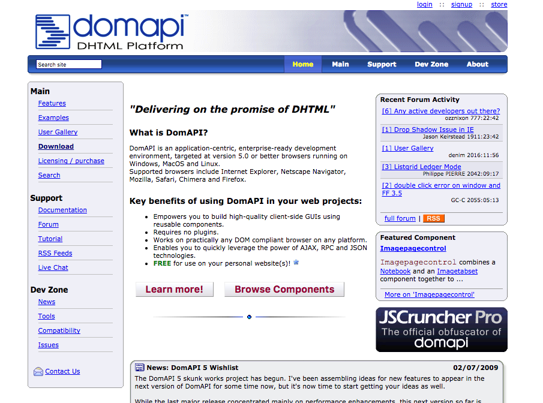

# DomAPI

This is the open sourced version of DomAPI 4.0

DomAPI was the original AJAX, DHTML, RIA Library and saw heavy usage and growth from 2001 until roughly 2008.

A 5.0 version was being developed, however I lacked the time to invest in the project and have stopped working on it completely.

The code's been gathering dust now since 2012 and I figured it best at this point to hand it over to the community at large.

A lot of the components and APIs still work beautifully, and since this was written to run on machines of the era, it runs **very** quickly and is quite memory efficient.

For more information, please see:

*  [Documentation](./docs/index.htm)
*  [Examples](./examples/index.htm)
*  [Tutorial](./tutor/tutor_index.htm)

Please feel free to fork this repository and do what you will with the code.  I can provide limited support, but honestly I've not looked at this code for quite a while now.

The original site, complete with the old discussion forums can be found on the [Wayback Machine](https://web.archive.org/web/20150930175348/http://domapi.com/).

